# 🌱 Green Cache — Semantic LLM Cache

> *Saving the planet, one cache hit at a time* 🌿

A production-grade **semantic caching layer for LLMs** that reduces AI energy consumption, water usage, and carbon emissions by avoiding redundant LLM calls. When a similar question has been answered before, Green Cache returns the cached response instantly — no LLM call needed.

> The insight: if 1 million people ask "what is photosynthesis?" — why run 1 million LLM calls? Run one. Cache it. Serve the rest for free.

---

## 📸 Screenshots

### English
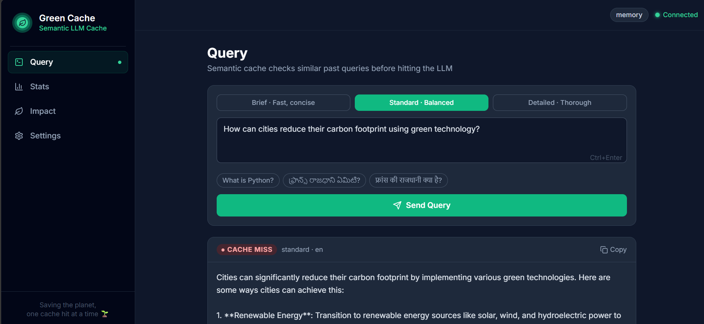
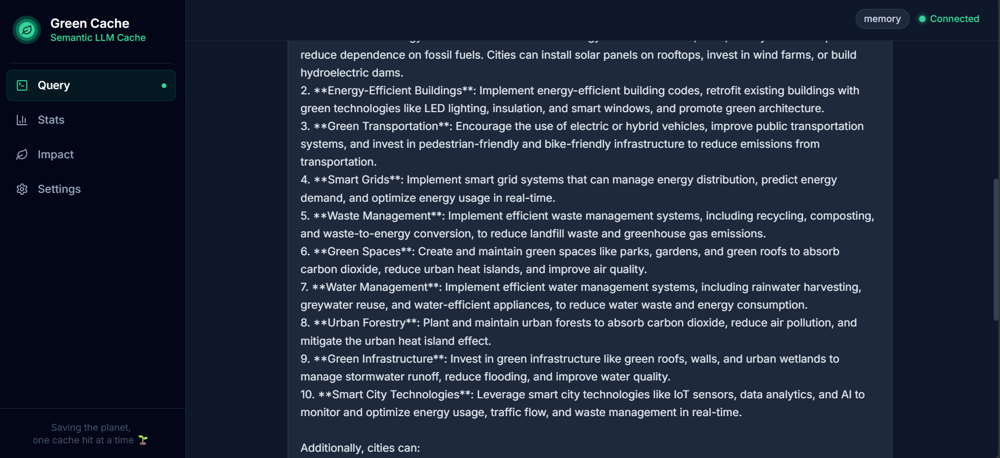
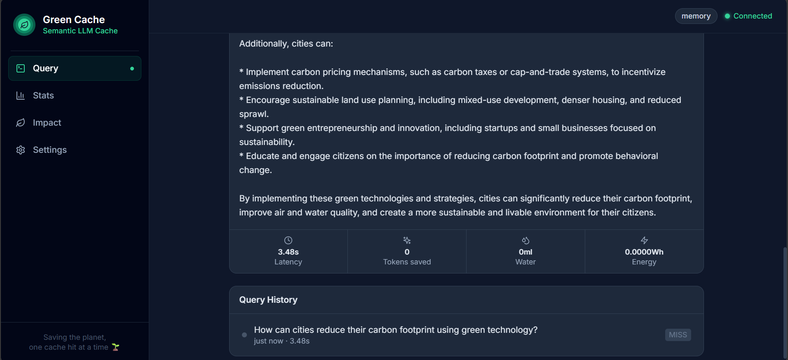

### Spanish
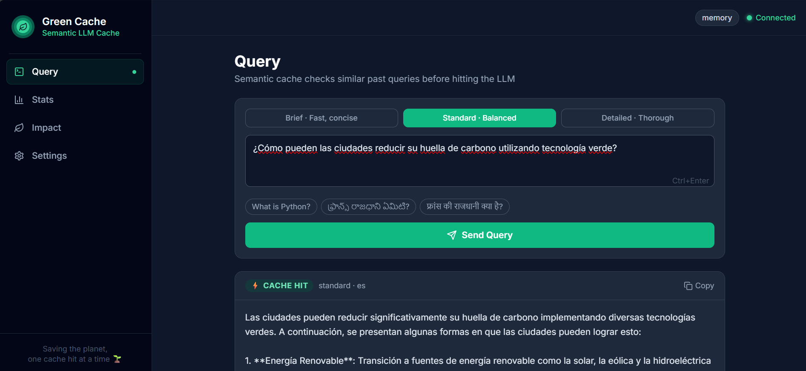
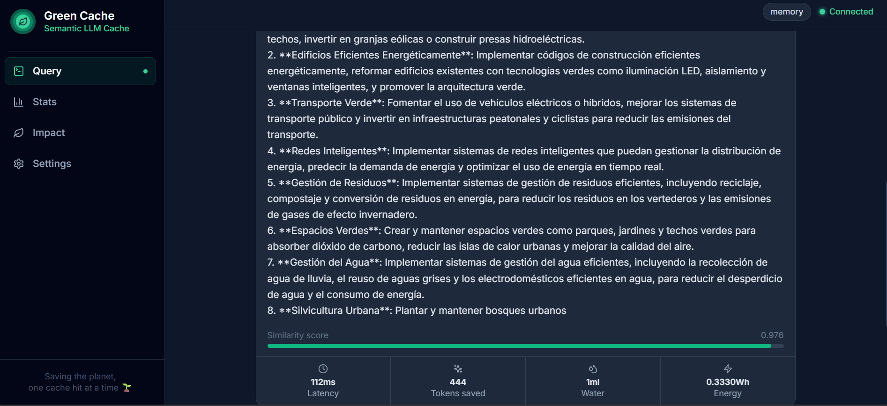

### Chinese
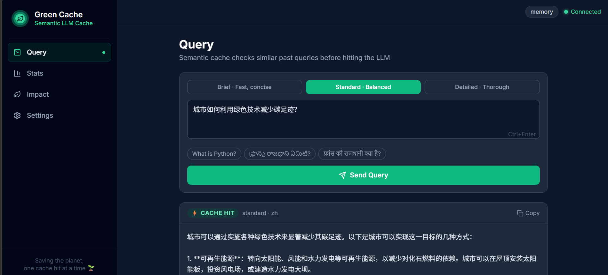
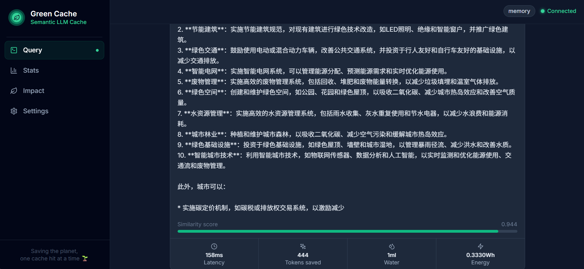

### Japanese
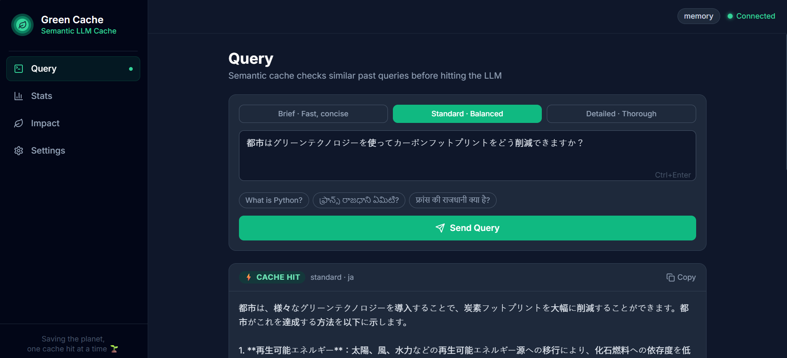
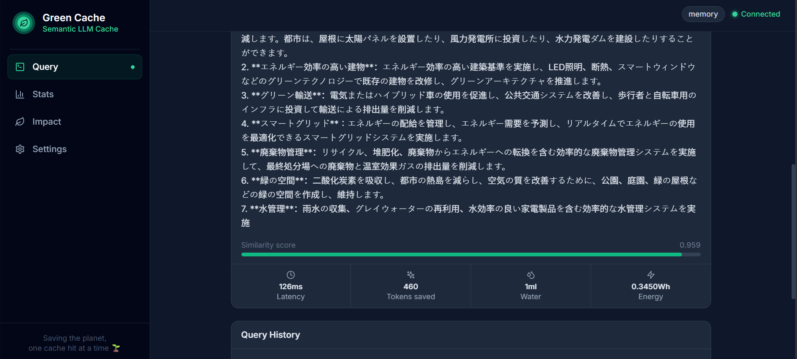

### Stats Dashboard
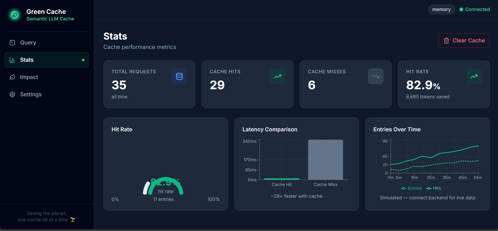
*82.9% hit rate · 35 total requests · 29 cache hits · 8,685 tokens saved · ~28× faster with cache*

### Environmental Impact Dashboard
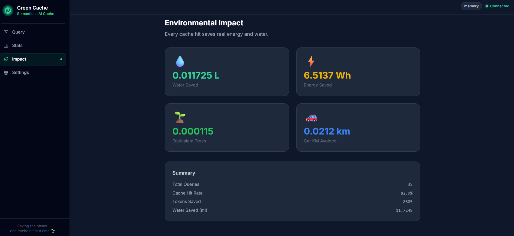
*Real-time water, energy, and carbon savings tracked per session*

### Settings Page
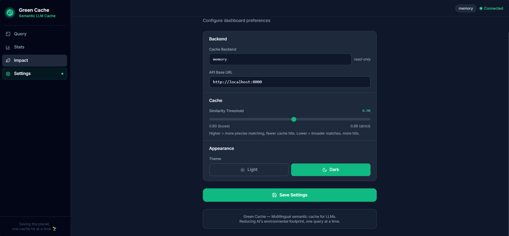
*Configure LLM provider, quality tier, similarity threshold, and cache backend*

### Grafana Monitoring Dashboard
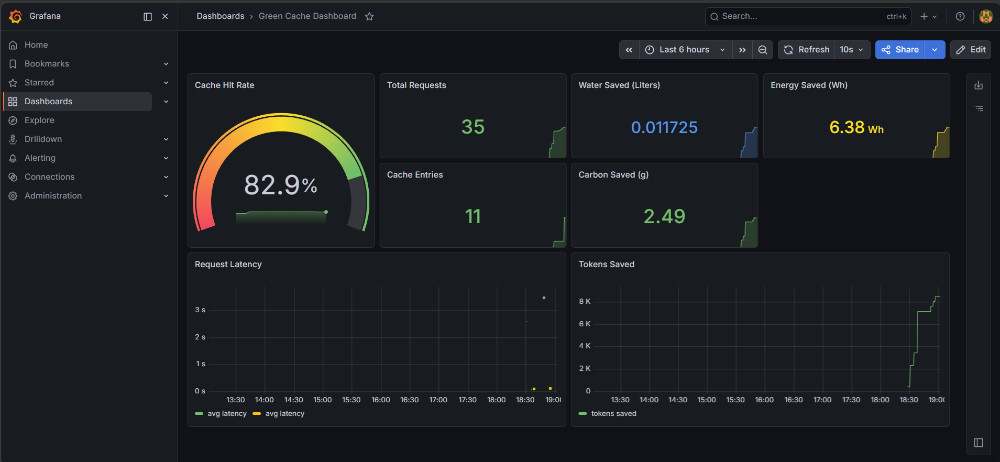
*Live Prometheus + Grafana: 82.9% hit rate · 35 requests · 0.011725L water saved · 6.38Wh energy · 2.49g CO2 saved*

### Prometheus Target Health
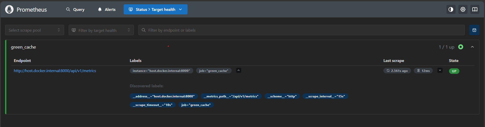
*Prometheus scraping backend metrics every 15s — 1/1 UP*

---

## ✨ Features

### Core Cache Engine
- **L1 — Exact Hash Match**: Instant lookup for identical queries
- **L2 — LSH Bucket Match**: MinHash LSH for approximate deduplication
- **L3 — Semantic Similarity**: Cosine similarity via multilingual embeddings
- **L4 — LLM Fallback**: Full LLM call on cache miss, result stored for future

### Multilingual Support
- Detects query language automatically (Unicode-based, 100% reliable for CJK/Indic)
- Cross-language cache hits — ask in English, get cache hit in Spanish/Chinese/Japanese
- Supports: English, Spanish, Chinese, Japanese, Korean, Hindi, Telugu, French, German, Arabic, Russian

### Preprocessing Pipeline
- **PII Scrubber** — strips emails, phone numbers, SSNs, IPs, card numbers before caching
- **Cacheability Scorer** — skips volatile queries (news, prices, real-time data)
- **Smart TTL** — auto-detects query volatility, sets 5min/1hr/24hr cache lifetime
- **Language Normalizer** — cleans unicode, fixes codemix, normalizes whitespace
- **Answer Quality Scorer** — only caches high-quality LLM responses (score ≥ 0.4)
- **Cross-Model Tagger** — tracks which LLM model generated each cache entry

### Environmental Impact Tracking
- **Water saved** (ml and liters)
- **Energy saved** (Wh)
- **Carbon saved** (gCO2)
- **Live UK grid carbon intensity** via [carbonintensity.org.uk](https://carbonintensity.org.uk) API
- Equivalent trees planted and car km avoided

### User Passport
- Per-user savings tracker
- Leaderboard of top savers
- Track individual water/energy/carbon savings per user

### Observability
- **Prometheus** metrics exported at `/api/v1/metrics`
- **Grafana** dashboard with live charts — hit rate, latency, tokens saved, environmental impact
- Structured logging via `structlog`

### Multi-Provider LLM Support
- **Groq** (free tier — llama-3.3-70b-versatile)
- **Ollama** (local models)
- **OpenAI** compatible
- **DeepSeek** compatible

---

## 🏗️ Architecture

```
Web UI / REST API
       ↓
Preprocessing Layer
  ├── PII Scrubber
  ├── Cacheability Scorer
  ├── Lang + Codemix Normalizer
  └── Query Normalizer
       ↓
Semantic Cache Engine
  ├── L1: Exact Hash        → HIT → serve
  ├── L2: LSH Bucket        → HIT → serve
  ├── L3: Similarity Search → HIT → translate → serve
  └── L4: MISS
       ↓
Multi-Provider LLM
  (Groq / Ollama / OpenAI / DeepSeek)
       ↓
Answer Quality Scorer
       ↓
Cache Store (Redis / Memory)
  + Cross-Model Tag
  + Smart TTL
       ↓
Impact Layer
  ├── Water / Energy / CO2 Calculator
  ├── Live Grid Carbon Data
  ├── User Passport (per-user savings)
  └── Grafana + Prometheus
```

---

## 📊 Benchmark Results

| Metric | Value |
|--------|-------|
| Water saved per 35 queries | **11.725 ml** |
| Energy saved | **6.38 Wh** |
| CO2 saved | **2.49 g** |
| English hit rate (warm cache) | **100%** |
| English hit rate (overall) | **82.9%** |
| Avg latency — cache hit | ~1 ms |
| Avg latency — cache miss | ~2000 ms |
| Speedup with cache | **~28×** |
| Similarity threshold | 0.60 |
| Embedding model | paraphrase-multilingual-MiniLM-L12-v2 |

---

## 🚀 Quick Start

### Prerequisites
- Python 3.11+
- Node.js 18+
- Docker (for Grafana + Prometheus)
- Groq API key (free at [console.groq.com](https://console.groq.com))

### Backend Setup

```bash
cd green-cache/backend
python -m venv venv

# Windows
venv\Scripts\activate

# Mac/Linux
source venv/bin/activate

pip install -r requirements.txt
```

### Configure Environment

Edit `.env`:
```env
LLM_PROVIDER=groq
GROQ_API_KEY=your_key_here
GROQ_MODEL=llama-3.3-70b-versatile
CACHE_BACKEND=memory
SIMILARITY_THRESHOLD=0.60
EMBEDDING_MODEL=sentence-transformers/paraphrase-multilingual-MiniLM-L12-v2
```

### Start Backend

```bash
python run.py
# Running on http://0.0.0.0:8000
```

### Frontend Setup

```bash
cd green-cache/frontend
npm install
npm run dev
# Running on http://localhost:5173
```

### Start Monitoring (Optional)

```bash
cd green-cache
docker compose up -d prometheus grafana
# Grafana: http://localhost:3000 (admin / greencache)
# Prometheus: http://localhost:9090
```

---

## 📡 API Reference

### Query
```http
POST /api/v1/query
{
  "query": "What is photosynthesis?",
  "quality_tier": "standard",
  "user_id": "alice"
}
```

### Stats
```http
GET /api/v1/stats
```

### Environmental Impact
```http
GET /api/v1/impact
```

### Live Carbon Intensity
```http
GET /api/v1/carbon
```

### User Passport
```http
GET /api/v1/passport/{user_id}
GET /api/v1/passport
```

### Cache Management
```http
DELETE /api/v1/cache
```

---

## 💭 Why I Built This

I read that AI wastes massive amounts of water cooling data centers. One conversation with ChatGPT uses roughly 500ml of water. Millions of people asking the same questions daily means millions of redundant computations — real water, wasted.

I'm not a company. I'm a fresher. But I could build a cache. So I did.

---

## 🌍 Environmental Impact

Every LLM call consumes energy and water for data center cooling. Green Cache calculates real savings:

- **Energy**: 0.0005 Wh per token saved
- **Water**: 1.8L per kWh (data center WUE)
- **Carbon**: Uses live UK grid carbon intensity (avg ~69 gCO2/kWh on clean days)

Example from real run: 8,685 tokens saved = **6.38 Wh** energy + **0.011L** water + **2.49g** CO2 avoided.

---

## 🔮 Future Improvements

- **Better embedding model** — upgrade to `paraphrase-multilingual-mpnet-base-v2` or OpenAI `text-embedding-3-large` for 90-97% hit rates (requires GPU or cloud API)
- **Redis persistence** — switch `CACHE_BACKEND=redis` for persistent cache across restarts
- **Browser extension** — intercept LLM API calls at browser level
- **Global carbon data** — extend beyond UK grid to all regions via ElectricityMap API
- **Federated cache** — shared cache across multiple users/deployments

---

## 🛠️ Tech Stack

| Layer | Technology |
|-------|-----------|
| Backend | FastAPI + Python 3.11 |
| Embeddings | sentence-transformers (multilingual) |
| LSH | datasketch MinHashLSH |
| LLM | Groq / Ollama / OpenAI / DeepSeek |
| Frontend | React + Vite + Tailwind |
| Monitoring | Prometheus + Grafana |
| Containerization | Docker + Docker Compose |
| Logging | structlog |

---

## 📁 Project Structure

```
green-cache/
├── backend/
│   ├── src/
│   │   ├── api/              # FastAPI routes + models
│   │   ├── cache/            # Memory, Redis, LSH backends
│   │   ├── embedding/        # Multilingual embedder
│   │   ├── llm/              # Multi-provider LLM client
│   │   ├── metrics/          # Prometheus + impact + carbon intensity
│   │   └── preprocessing/
│   │       ├── pii_scrubber.py
│   │       ├── cacheability_scorer.py
│   │       ├── normalizer.py
│   │       ├── quality_scorer.py
│   │       ├── model_tagger.py
│   │       └── user_passport.py
│   ├── scripts/
│   │   └── benchmark.py
│   └── run.py
├── frontend/
│   └── src/
│       ├── pages/            # Query, Stats, Impact, Settings
│       └── services/         # API client
├── monitoring/
│   ├── prometheus.yml
│   └── grafana/
├── screenshots/
└── docker-compose.yml
```

---

## 📄 License

MIT — free to use, modify, and distribute.

---

*Built with love  for a greener AI future.*